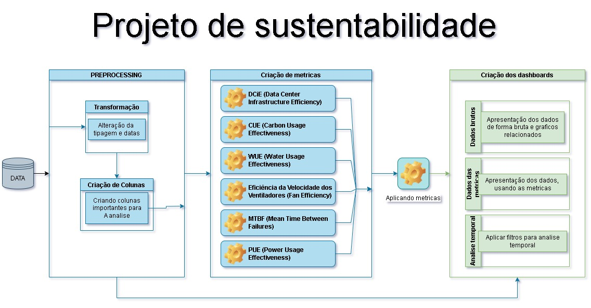

# TI-AS--Monitoring_energy

## Identificação do Grupo
- **Alexandre França Quirino dos Santos**
- **Davi Jorge Leite Santos**
- **Heitor Meinicke Ribeiro**
- **Samuel Rodrigues Cardilo Van Petten**
- **Samuel Vitor Cardoso Santos**

# Dashboard de Monitoramento Energético para Otimização da Eficiência Energética

## 1. Apresentação
O presente projeto visa desenvolver um dashboard de monitoramento energético para uma empresa que enfrenta desafios relacionados ao consumo de energia. O objetivo principal é fornecer uma visão clara e detalhada dos dados energéticos, permitindo a identificação de ineficiências e a tomada de decisões informadas para melhorar o desempenho energético da empresa. De acordo com a Agência Internacional de Energia, a eficiência energética pode reduzir significativamente os custos operacionais e a pegada de carbono de uma empresa, contribuindo para a sustentabilidade ambiental e econômica.

### 1.1 Cliente

Aqui está o texto com as informações adicionais:

Nosso cliente é a Justweb, uma empresa de telecomunicações fundada em 2013 em Ribeirão das Neves, na região metropolitana de Belo Horizonte. A Justweb começou oferecendo internet via rádio e, ao longo dos anos, evoluiu para o uso de fibra óptica, alcançando quase 40 mil assinantes em diversas cidades da região metropolitana de Belo Horizonte. Em setembro de 2023, a empresa foi adquirida pelo grupo Brasil TecPar, o que reforçou ainda mais a qualidade dos serviços prestados e consolidou o seu comprometimento com a transformação no setor de telecomunicações em Minas Gerais e no Brasil.

A Justweb é reconhecida pela sua estrutura de rede organizada, equipe experiente e atendimento ao cliente humanizado, o que levou a empresa a conquistar diversos prêmios municipais e estaduais. A missão da Justweb é surpreender o cliente com alta performance de conectividade, promovendo inclusão, diversidade e qualidade de vida. Sua visão é ser o melhor ISP de Minas Gerais, com suporte rápido e humanizado, garantindo o crescimento sustentável. Seus valores incluem pontualidade, ética, excelência no atendimento, segurança dos colaboradores, empatia, inovação constante, relações humanizadas e gestão por dados.

O gestor do projeto de monitoramento energético é Saulo Guadalupe, gestor de infraestrutura geral da Justweb, com mais de 20 anos de experiência na área. Ele será o principal responsável por garantir que o dashboard atenda às necessidades de monitoramento e otimização do consumo energético da empresa, proporcionando uma visão clara e detalhada dos dados para a identificação de ineficiências e a tomada de decisões informadas.

Os usuários do dashboard serão principalmente os gestores de energia e os técnicos responsáveis pelo monitoramento e análise do consumo energético. Estes usuários possuem conhecimentos técnicos variados, desde gestores com foco em tomada de decisões estratégicas até técnicos operacionais que lidam diretamente com o monitoramento e manutenção dos sistemas energéticos.

### 1.2 Problema
A empresa está enfrentando problemas de eficiência energética, resultando em altos custos de energia e ineficiências operacionais. O problema central é a falta de visibilidade e controle sobre o consumo energético, dificultando a identificação de áreas de desperdício e a implementação de medidas corretivas eficazes. Isso não só afeta a competitividade da empresa, como também aumenta sua pegada de carbono, contrariando práticas sustentáveis.

### 1.3 Objetivo do Trabalho
O objetivo geral do projeto é criar um dashboard de monitoramento energético que permita à empresa melhorar sua eficiência energética. Os objetivos específicos incluem:
- Monitorar a eficácia do uso da energia através do Power Usage Effectiveness (PUE).
- Gerar relatórios detalhados de eficiência energética.
- Analisar o desempenho energético para identificar ineficiências.
- Desenvolver análises detalhadas de gastos energéticos.
- Implementar dashboards interativos e intuitivos para facilitar a visualização dos dados.

Além disso, será apresentada uma descrição arquitetural do sistema, permitindo um aprofundamento no desenvolvimento do trabalho.

### 1.4 Definições e Abreviaturas
- **PUE (Power Usage Effectiveness):** Métrica utilizada para determinar a eficiência energética de um data center, calculada pela divisão da energia total consumida pelo data center pela energia utilizada apenas pelo equipamento de TI.
- **Eficiência Energética:** Uso eficiente de energia para reduzir o desperdício e o consumo desnecessário, melhorando o desempenho econômico e ambiental.
- **Dashboard:** Interface gráfica que organiza e apresenta informações de forma visual, permitindo uma análise rápida e intuitiva dos dados.
- **Sustentabilidade:** Prática de manter processos que não esgotam os recursos naturais e que permitem um desenvolvimento equilibrado e responsável.
- **Gestores de Energia:** Profissionais responsáveis pela administração e otimização do consumo energético de uma organização.

## 1.5. Requisitos Funcionais
- **Monitoramento de PUE (Power Usage Effectiveness):** Implementação de métricas para monitorar a eficácia do uso de energia.
- **Relatórios de Eficiência Energética:** Criação de relatórios detalhados sobre o consumo energético e a eficiência.
- **Análise de Desempenho:** Ferramentas para analisar o desempenho energético e identificar áreas de melhoria.
- **Análise de Gasto Energético:** Avaliação detalhada dos custos de energia e identificação de desperdícios.
- **Desenvolvimento dos Dashboards:** Criação de interfaces intuitivas para visualização dos dados energéticos.

### 1.6. Cronograma

| **Data**  | **Sprint** | **Atividade** | **Ponto de Foco** | **Pontos** |
|-----------|------------|---------------|-------------------|------------|
| **5/08**  | Apresentação da Disciplina | Introdução à disciplina, com apresentação dos objetivos e expectativas. | Compreender a importância do projeto para a disciplina e como ele se alinhará aos objetivos extensionistas. | - |
| **12/08** | Definição dos Grupos, Clientes/Parceiros e Proposta de Temas dos Trabalhos | Formação dos grupos, identificação do cliente/parceiro, e proposta inicial dos temas a serem abordados. | Definir claramente o tema do projeto e garantir que o cliente/parceiro esteja de acordo com a proposta. | - |
| **19/08** | Sprint 1: Elaboração da Proposta | Desenvolvimento da Seção 1: Elaboração da descrição do projeto, contendo identificação do grupo, contextualização, tema, objetivo e cronograma. | Especificar os objetivos do projeto e estabelecer um cronograma claro. | - |
| **26/08** | Sprint 1: Continuação da Elaboração da Proposta | Revisão e refinamento da Seção 1: Descrição do projeto. | Garantir que todos os membros do grupo e o cliente estejam alinhados com a proposta. | - |
| **2/09**  | Sprint 1: Apresentação da Proposta | Apresentação da descrição do projeto, contendo identificação do grupo, contextualização, tema, objetivo e cronograma. | Receber feedback do professor e realizar ajustes conforme necessário. | 15 |
| **9/09**  | Sprint 2: Descrição Arquitetural - Requisitos | Desenvolvimento da Seção 2: Requisitos – versão inicial. | Identificar e documentar todos os requisitos funcionais e não funcionais do sistema. | - |
| **16/09** | Sprint 2: Revisão dos Requisitos | Refinamento da Seção 2: Requisitos – versão revisada. | Ajustar os requisitos com base no feedback e novas descobertas. | - |
| **23/09** | Sprint 2: Apresentação dos Requisitos | Apresentação da Seção 2: Requisitos – versão final. | Obter validação final dos requisitos junto ao cliente e ao professor. | 15 |
| **30/9**  | Sprint 3: Modelagem e Diagramas Arquiteturais | Desenvolvimento da Seção 3: Modelagem e Diagramas Arquiteturais – versão inicial. | Criar modelos e diagramas que representem a arquitetura do sistema. | - |
| **7/10**  | Sprint 3: Apresentação da Modelagem e dos Diagramas | Apresentação da Seção 3: Modelagem e Diagramas Arquiteturais – versão final. | Garantir que a modelagem atenda aos requisitos e esteja alinhada com a visão do cliente. | 15 |
| **21/10** | Sprint 4: Implementação da Solução Proposta – Parte 1 | Desenvolvimento da parte inicial da solução. | Implementar os componentes principais da solução, priorizando a funcionalidade central. | - |
| **28/10** | Sprint 4: Revisão da Implementação – Parte 1 | Revisão e ajustes na implementação com base em testes e feedback. | Melhorar a robustez e a eficiência da solução. | - |
| **4/11**  | Sprint 4: Segunda Revisão da Implementação – Parte 1 | Continuação dos ajustes e melhorias na implementação da solução. | Garantir que a implementação esteja alinhada com os requisitos e preparada para a apresentação. | - |
| **11/11** | Sprint 4: Terceira Revisão da Implementação – Parte 1 | Finalização dos ajustes e preparação para a apresentação. | Concluir a parte 1 da solução com todos os requisitos definidos. | - |
| **18/11** | Sprint 4: Apresentação da Implementação da Solução – Parte 1 | Apresentação da parte 1 da solução implementada e planejamento da Sprint 5. | Receber feedback para refinar e planejar a próxima fase. | 15 |
| **25/11** | Sprint 5: Implementação da Solução Proposta – Parte 2 | Desenvolvimento inicial da parte 2 da solução. | Expandir a funcionalidade e integrar os componentes restantes da solução. | - |
| **2/12**  | Sprint 5: Revisão da Implementação – Parte 2 | Revisão e ajustes na parte 2 da solução. | Garantir a coerência e a integridade da solução como um todo. | - |
| **9/12**  | Sprint 5: Apresentação da Implementação Final da Solução | Apresentação da solução final com todos os requisitos implementados. | Mostrar uma solução completa e funcional para o cliente e o professor. | 15 |
| **16/12** | Apresentação Final | Apresentação dos resultados do projeto, incluindo feedback do cliente (vídeo, áudio, foto, texto). | Realizar a autoavaliação e avaliação por pares, encerrando o projeto. | 25 |

## 3. Modelagem e diagramas arquiteturais
Imagem de forma macro do projeto.

